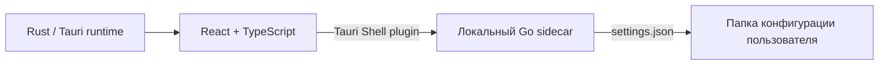
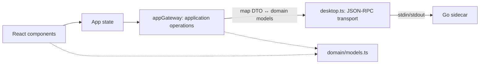

# Архитектура BetterSoundCloud

## Текущая реализация

Приложение использует Tauri 2 как desktop-оболочку, React + TypeScript для интерфейса и Go sidecar для локального API и настроек. Сетевой сервер и база данных не нужны.



Tauri webview не получает Node.js доступ. Frontend запускает только заранее сконфигурированный sidecar `binaries/local-api`; capability запрещает произвольные аргументы. Команды Go передаются JSON-строками через stdin, ответы возвращаются JSON-строками через stdout. stderr используется только для локальной диагностики.

## Компоненты

- `src/renderer` — интерфейс React, стили и точка входа Vite.
- `src/renderer/domain/models.ts` — интерфейсные модели, не зависящие от RPC или SoundCloud DTO.
- `src/renderer/lib/appGateway.ts` — адаптер UI/backend; преобразует DTO в доменные модели и предоставляет приложению операции.
- `src/renderer/lib/desktop.ts` — транспорт JSON-RPC: запускает sidecar и связывает ID запросов с ответами.
- `src-tauri/src/main.rs` — запускает Tauri и подключает shell plugin.
- `src-tauri/tauri.conf.json` — окно, CSP, frontend и sidecar bundle.
- `src-tauri/capabilities/default.json` — разрешает запуск только Go sidecar без аргументов и запись в его stdin.
- `backend/cmd/local-api` — локальные команды приложения, сохранение настроек и авторизация SoundCloud.
- `backend/cmd/local-api/main_test.go` — тесты авторизации на подставном SoundCloud-сервере.
- `scripts/build-go.mjs` — кросс-компилирует Go sidecar и именует бинарник по Tauri target triple.
- `scripts/backend-console.mjs` — интерактивная JSON-RPC консоль sidecar для ручной проверки методов без Tauri.
- `backend/cmd/local-api/main.go` — при `BSC_SWAGGER=1` дополнительно поднимает Swagger UI и loopback HTTP bridge для ручной отладки JSON-RPC.
- `scripts/test-backend-live.mjs` — запускает живой тест SoundCloud с токеном из `.env`.

## Локальный API

Каждый запрос и ответ занимает одну JSON-строку. Запрос: `{ "id": 1, "method": "settings.get", "params": {} }`. Ответ включает тот же `id`, а также `result` или `error`.

| Метод | Назначение |
| --- | --- |
| `app.info` | Имя, версия и тип локального backend |
| `settings.get` | Чтение настроек |
| `settings.update` | Проверка и запись части настроек |
| `auth.login` | Проверка access token в SoundCloud и сохранение сессии |
| `auth.status` | Признак входа и кэшированный профиль (без токена) |
| `auth.refresh` | Перепроверка сохранённого токена; отклонённый токен удаляется |
| `auth.logout` | Локальное удаление токена |
| `tracks.mine` | Лайкнутые треки аккаунта |
| `search.tracks` | Поиск треков SoundCloud |
| `track.details` | Детали трека по ID |
| `track.related` | Похожие треки по ID |
| `mixed.selections` | Подборки SoundCloud для главной |
| `track.like` / `track.unlike` | Изменение лайка |

Настройки: цвет акцента, компактный режим, начальная громкость и публичный SoundCloud Client ID. Go валидирует значения, пишет JSON во временный файл и атомарно заменяет `settings.json` в системном каталоге конфигурации пользователя. Access token задаётся отдельно через `auth.login`: backend проверяет его запросом профиля и хранит в отдельном локальном файле с ограниченными правами; токен не включается в `settings.get`.

Новые функции добавляются как узкие RPC-методы Go и операции в `desktop.ts`. Их вызовы и преобразование данных подключаются в `appGateway.ts`. UI использует только доменные модели и gateway: React-компоненты не импортируют backend DTO, не вызывают `window.desktop`, не формируют SoundCloud URL и не знают имена RPC. Не предоставлять renderer произвольный запуск процессов или системный доступ.

### Граница UI и backend



Правила переноса или полной замены интерфейса:

1. Компоненты получают данные и действия через props, используют только типы из `domain/models.ts` и не обращаются к `window.desktop`.
2. `appGateway.ts` — единственное место renderer, которое знает wire-типы и имена backend-операций. Backend-поля преобразуются здесь в стабильную модель UI.
3. `desktop.ts` отвечает только за запуск sidecar и JSON-RPC. Он не содержит UI-логику и не импортирует React.
4. Go не знает о компонентах, страницах или дизайне. Изменения интерфейса не требуют изменений Go, пока имеющегося контракта достаточно.
5. Для новых backend-данных добавляется отдельный RPC и DTO, затем mapping в gateway. Существующий контракт не меняется несовместимо без необходимости.
6. Renderer передаёт только узкие параметры, например ID трека или поисковый запрос. Токен, произвольные URL и команды остаются на стороне sidecar.

В режиме разработки `BSC_SWAGGER=1 npm run dev` sidecar дополнительно слушает только `127.0.0.1` на случайном порту, печатает URL Swagger UI в stderr и публикует `/openapi.json` и `POST /rpc`. Генератор автоматически находит экспортированные методы `RPC...` на `service`; имена методов, типы параметров и результатов берутся из сигнатур Go, а поля моделей — из Go-типов и JSON-тегов. Добавление метода не требует отдельной записи в реестре. Этот HTTP bridge выключен по умолчанию; desktop-приложение продолжает использовать stdin/stdout. Swagger UI раздаётся через unpkg CDN.

## Авторизация (текущая реализация)

Полный OAuth-поток из [SOUNDCLOUD_INTEGRATION.md](SOUNDCLOUD_INTEGRATION.md) пока не подключён. Сейчас работает ручное подключение аккаунта по access token, что позволяет проверять интеграцию с SoundCloud API до регистрации OAuth-приложения.

1. Renderer показывает экран входа и передаёт вставленный токен в `auth.login` (таймаут запроса — 30 секунд).
2. Go sidecar проверяет токен запросом `GET /me`: сначала `https://api-v2.soundcloud.com` (токены веб-сессии), затем `https://api.soundcloud.com` (OAuth-токены зарегистрированных приложений). Хост можно переопределить через `BSC_SOUNDCLOUD_API_BASE`.
3. При успехе Go сохраняет `{ token, profile, savedAt }` в `auth.json` в системном каталоге конфигурации приложения с правами `0600` и атомарной записью. Renderer получает только признак входа и профиль (`username`, `avatarUrl`, счётчики) — сам токен никогда не покидает sidecar и не попадает в `localStorage`.
4. При старте приложения renderer вызывает `auth.refresh`: если SoundCloud отклонил токен, сессия очищается и показывается экран входа; при сетевой ошибке кэшированный профиль сохраняется.
5. Выход (`auth.logout`) удаляет токен только локально и не отзывает доступ в аккаунте SoundCloud.

Хранилище токена в файле — промежуточное решение. Целевая схема из SOUNDCLOUD_INTEGRATION.md переносит токены в системный credential store и добавляет OAuth 2.1 + PKCE через сервер авторизации.

## Запуск и сборка

Нужны Node.js, Rust/Cargo, Go 1.22+ и системные зависимости Tauri 2.

```bash
npm install
npm run dev
```

Tauri запускает `prepare:dev`: сборку Go sidecar и Vite dev server. Production:

```bash
npm run build
npm run package
```

Go sidecar кладётся в `src-tauri/binaries/local-api-<TARGET_TRIPLE>` и добавляется в bundle как external binary. Текущий скрипт автоматически определяет распространённые desktop-архитектуры; для новых или кросс-целей нужно добавить соответствие Go OS/ARCH и Tauri triple в `scripts/build-go.mjs`.

## Текущие границы

Реализованы desktop-окно, локальный backend, настройки и ручная авторизация по access token. Полный OAuth-вход, методы SoundCloud API (медиатека, поиск, лайки), воспроизведение и системный credential store для токенов не входят в текущую реализацию.
